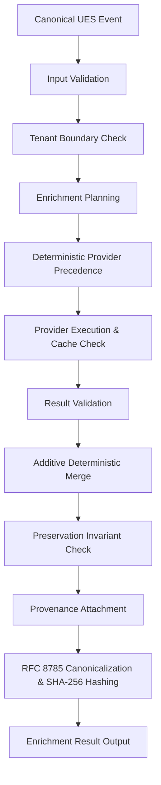

# ULPF Module M4 — System Architecture

## 1. Architectural Scope & Responsibility
Module M4 is the **Enrichment, Provenance, and Integrity** subsystem of the Universal Log Processing Framework (ULPF).

### Responsibilities Owned by M4:
- Contextual enrichment (Assets, GeoIP, ASN, Threat Intelligence, Custom Rules)
- Deterministic additive merge without mutation of authoritative canonical truth
- Lineage and provenance recording for every enrichment operation
- Cryptographic integrity calculation and verification using deterministic RFC 8785 canonical JSON and SHA-256
- Provider management, deterministic precedence, and failure isolation
- Tenant isolation across caching and execution
- Structured logging and telemetry (Prometheus metrics)

### Strictly Prohibited from M4:
- Raw log ingestion or ingestion persistence (M1 domain)
- Vendor parsing and log classification (M2 domain)
- Schema normalization into UES (M3 domain)
- Event routing and SIEM delivery (M5 domain)
- Control plane administration (M6 domain)

---

## 2. Pipeline Execution Flow

### Pipeline Phases:
1. **Input Validation**: Rejects malformed events, unapproved schemas, missing IDs, or corrupt timestamps without attempting silent repairs.
2. **Tenant Boundary Verification**: Enforces that event tenant matches the authorized execution context.
3. **Planning & Precedence**: Evaluates active declarative rules and sorts candidate providers deterministically by:
   `Configured Priority -> Intrinsic Provider Priority -> Lexicographical Provider ID tie-breaker`.
4. **Provider Execution & Caching**: Executes providers under strict deadlines. On timeout or exception, failure isolation captures the failure as a diagnostic, preserving the original event.
5. **Additive Merge**: Injects enriched attributes strictly into `event.extensions["enrichment"][namespace]`. Upstream canonical truth is immutable.
6. **Preservation Invariant Check**: Proves that `event.id`, `event.timestamp`, `provenance.raw_event_id`, `tenant_id`, and network endpoints were not altered.
7. **Provenance Attachment**: Records provider version, timestamp, confidence, execution status, and cache status into `extensions["enrichment"]["provenance"]`.
8. **Cryptographic Integrity**: Strips the self-referential `integrity` block, serializes the event via RFC 8785 JCS, computes SHA-256, and attaches the resulting `IntegrityMetadata`.

---

## 3. Provider Architecture
Providers extend `EnrichmentProvider` and implement:
- `can_enrich(event: CanonicalEvent, context: EnrichmentContext) -> bool`
- `enrich(event: CanonicalEvent, context: EnrichmentContext) -> ProviderOutput`

### First-Party Providers Built into M4:
1. **LocalAssetProvider**: CMDB/Asset inventory lookup based on `source.ip` or `host.name`. Enforces tenant-specific and shared assets.
2. **LocalGeoIPProvider**: Subnet/CIDR-based GeoIP and ASN lookup. Automatically handles private networks and public test subnets.
3. **LocalThreatIntelProvider**: Deterministic IOC indicator lookup across IP and domain indicators.
4. **MockEnrichmentProvider**: Configurable mock provider for resilience, timeout, and failure isolation testing.
5. **HardenedHttpProvider**: Network-capable HTTP provider protected by `SSRFGuard` and bounded by timeout and 1MB response size limits.

---

## 4. Cryptographic Integrity & Determinism
- **RFC 8785 (JCS)**: Normalizes Unicode via NFC, formats IEEE 754 floats to shortest ECMAScript representation, sorts object keys lexicographically by UTF-16 code units, and produces deterministic byte streams.
- **SHA-256 Digest**: Computed over the canonical byte stream.
- **Verification**: Verifies digest match using constant-time comparison (`hmac.compare_digest`).
- **Authenticity Boundary**: Explicitly documents that SHA-256 guarantees tamper-evident integrity, not sender authenticity (which requires PKI/HMAC).

---

## 5. Security Architecture
- **SSRF Protection (`SSRFGuard`)**: Blocks loopback (`127.0.0.0/8`, `::1`), private ranges (`10.0.0.0/8`, `172.16.0.0/12`, `192.168.0.0/16`), link-local (`169.254.0.0/16`, `fe80::/10`), cloud metadata (`169.254.169.254`, `metadata.google.internal`), and carrier NAT.
- **Tenant Isolation (`TenantGuard`)**: Enforces isolated cache key generation `tenant_id:provider_id:namespace:key` and blocks cross-tenant execution.
- **Secret Sanitization (`sanitizers.py`)**: Redacts credentials, tokens, bearer headers, and passwords from log records and diagnostics.
