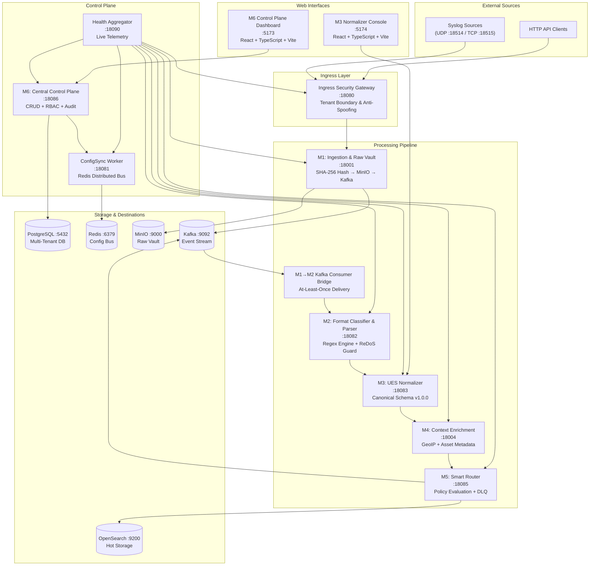
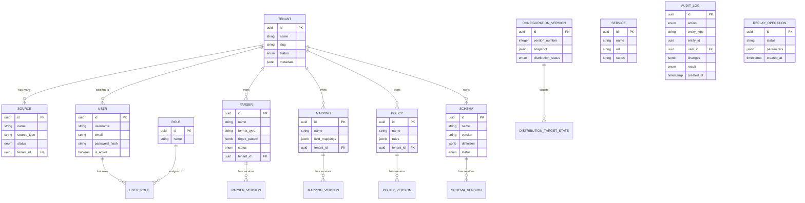

<div align="center">

# Universal Log Pre-processing Framework (ULPF)

### High-Throughput, Multi-Tenant Telemetry Normalization & Control-Plane Architecture

**Smart India Hackathon (SIH) · Problem Statement ID: SIH26156**  
**Organization**: National Technical Research Organisation (NTRO)  
**Category**: Software · **Theme**: Blockchain & Cybersecurity

---

[](#)
[](#)
[](#)
[](#)
[](#)

</div>

---

## Problem Statement (SIH26156)

> *"Design and develop a Universal Log Pre-processing Framework (ULPF) capable of ingesting, parsing, normalizing, and standardizing logs and events generated by any hardware or software system."*  
> — **National Technical Research Organisation (NTRO)** · Ministry / Agency: NTRO · Theme: Blockchain & Cybersecurity

### Background
Modern enterprises and critical national infrastructure generate massive volumes of logs from a wide range of sources, including network devices, firewalls, servers, operating systems, applications, databases, cloud services, containers, endpoint security tools, identity and access management systems, IoT devices, and hardware/software platforms. These logs are produced in diverse, inconsistent formats such as Syslog (RFC 3164/5424), JSON, XML, CSV, Key-Value (KV), CEF (ArcSight), LEEF (QRadar), proprietary vendor formats, and application-specific schemas.

The diversity of log structures creates severe challenges in centralized monitoring, security operations, compliance reporting, incident investigation, and threat analytics. Security teams often spend substantial effort developing source-specific parsers and normalization rules before data can be effectively utilized by SIEM, data lakes, or machine learning platforms.

As organizations adopt hybrid, multi-cloud, and AI-driven environments, the need for a **universal and extensible log standard** that accommodates both current and future data sources has become mission-critical.

### Detailed Description
ULPF provides a **high-throughput, vendor-agnostic, microservice-based log processing pipeline** capable of ingesting, parsing, normalizing, enriching, and routing logs from any hardware or software system. The framework:
- **Preserves complete raw event data** with SHA-256 cryptographic hashing for forensic and compliance requirements.
- **Transforms heterogeneous logs** into a unified schema (**Universal Event Schema - UES v1.0.0**) that enables consistent analytics, cross-vendor correlation, visualization, threat hunting, anomaly detection, and AI/ML pipelines.
- **Scales horizontally** to support Big Data environments handling billions of events per day with end-to-end cryptographic traceability and zero data loss.

---

## Alignment with Expected Solutions (SIH26156)

| Expected Requirement | ULPF Architecture & Implementation | Status |
|:---|:---|:---:|
| **a) Preserve complete raw event data without information loss** | **M1 Raw Vault Engine**: Ingested wire bytes are captured identically, SHA-256 hashed at ingress, and stored into an immutable MinIO/S3 object vault (`s3://ulpf-raw-vault/raw/{tenant}/{id}.dat`) with zero byte corruption or field truncation. | 🟢 **Implemented** |
| **b) Extract and parse source-specific attributes** | **M2 Regex & Grammar Parser Engine**: Modular multi-grammar parser extracts key security attributes across Syslog, JSON, KV, CEF, LEEF, and CSV with ReDoS polynomial backtracking guard and sub-millisecond execution timeouts. | 🟢 **Implemented** |
| **c) Normalize fields into a common event taxonomy** | **M3 Canonical Normalizer & UES v1.0.0**: Maps heterogeneous fields into RFC-8785 canonical taxonomy across network, identity, cloud, host, threat, and orchestration domains, while preserving original vendor fields under unmapped namespaces. | 🟢 **Implemented** |
| **d) Maintain traceability between normalized and original events** | **Cryptographic Lineage & Web Crypto Verification**: Bidirectional correlation linking `Raw Event ID` ↔ `Ingestion SHA-256` ↔ `Parser ID` ↔ `UES Event ID` ↔ `Enriched Digest` ↔ `Routing Destination`. Real-time Web Crypto client verification flags in-flight tampering or vault corruption. | 🟢 **Implemented** |
| **e) Plug-and-play onboarding of new log sources** | **Dynamic Source & Tenant Onboarding**: Register new log sources and configure custom parsers via the M6 Control Plane with zero service restarts. Atomic configuration deployment across M1–M5 via Redis distributed pub/sub bus. | 🟢 **Implemented** |
| **f) Unified visibility across enterprise environments** | **M6 Enterprise Control Plane Console**: Single-pane-of-glass dashboard providing live telemetry, operational health, multi-tenant event exploration, and lineage visualization across on-prem, cloud, and edge deployments. | 🟢 **Implemented** |
| **g) Efficient SIEM and Data Lake integration** | **M5 Smart Delivery Router**: Policy-driven multiplexing to OpenSearch (Hot SIEM search index), S3/MinIO Data Lake (Cold Parquet/JSON tier), Kafka (Real-time stream), and HTTP webhooks with automated backoff and Dead Letter Queue (DLQ). | 🟢 **Implemented** |
| **h) AI/ML-ready security and operational analytics** | **Normalized Feature-Complete UES Events**: Structured, strongly typed canonical events eliminate manual feature engineering, enabling direct ingestion into behavioral analytics (UEBA), anomaly detection, and ML threat hunting models. | 🟢 **Implemented** |
| **i) Reduced parser development effort** | **Visual Parser Studio**: Low-code regex builder, sandbox test runner, live syslog injection, and 15+ pre-built golden templates (Cisco, Microsoft, Fortinet, Linux, Palo Alto, AWS, CrowdStrike, Okta, Check Point, Suricata, Kubernetes). | 🟢 **Implemented** |
| **j) Deployable in an air-gapped network** | **Zero Internet Dependency**: Completely autonomous architecture running self-contained local MinIO, local Kafka/KRaft, local OpenSearch, local PostgreSQL, and bundled offline GeoIP databases for high-security, isolated national defense environments. | 🟢 **Implemented** |
| **k) Containerized for platform independence** | **Docker Compose & OCI Packaging**: Production-grade microservices containerization (`docker-compose.yml`) deployable across Linux, Windows Server, macOS, bare-metal, or Kubernetes (K8s/OpenShift). | 🟢 **Implemented** |

---

##  Our Solution Architecture

ULPF is a **microservice-based log processing pipeline** composed of 6 specialized engines (M1–M6), an integration layer, and two web interfaces. It solves the core data integration problem for enterprise cyber defense and national security operations:

| Stakeholder Persona | Operational Value Delivered |
|:---|:---|
| **SOC & Incident Response Analysts** | Unified event dashboard across all enterprise security appliances (Cisco ASA, Fortinet, Palo Alto, Windows Security, CrowdStrike, Check Point). |
| **Security & Infrastructure Administrators** | Multi-tenant isolation per organization/department, RBAC governance, immutable audit trail, and service health monitoring. |
| **Detection & Parser Engineers** | Visual regex studio with ReDoS protection, live sandbox testing, and zero-downtime hot rule distribution via Redis. |
| **Data Lake & AI/ML Engineers** | Normalized, feature-complete UES event streams ready for threat correlation, anomaly detection, and model training. |

The system processes raw security logs through a **5-stage pipeline** (Ingest → Classify → Normalize → Enrich → Route), governed by a central control plane with configuration distribution, policy management, and health observability.

---

##  Key Capabilities

| Capability | Description | Status |
|:--|:--|:--:|
| **Raw Log Ingestion** | UDP/TCP Syslog + HTTP API intake with SHA-256 cryptographic hashing | 🟢 |
| **Immutable Evidence Vault** | MinIO object storage cold vault for forensic raw log preservation | 🟢 |
| **Format Classification** | Regex-based parser engine with ReDoS polynomial backtracking guard | 🟢 |
| **Parser Studio** | Visual regex builder, sandbox test runner, live syslog testing | 🟢 |
| **UES Normalization** | Universal Event Schema v1.0.0 synthesis with vendor field preservation | 🟢 |
| **Context Enrichment** | GeoIP, asset metadata, and threat intelligence enrichment | 🟢 |
| **Smart Routing** | Policy-driven delivery to OpenSearch, S3 Data Lake, Kafka, HTTP webhooks | 🟢 |
| **Dead Letter Queue** | Failed delivery retry engine with exponential backoff and DLQ management | 🟢 |
| **Multi-Tenant Isolation** | Tenant boundary enforcement, per-tenant configuration, anti-spoofing | 🟢 |
| **RBAC & Audit** | 5-role hierarchy with complete audit logging of all administrative actions | 🟢 |
| **Configuration Distribution** | Atomic versioned config deployment to M1–M5 via Redis distributed bus | 🟢 |
| **Event Replay** | Re-process historical events through the pipeline with full traceability | 🟢 |
| **Pipeline Health Monitoring** | Live telemetry aggregation across all 8+ services with readiness probing | 🟢 |
| **Observability Stack** | Prometheus metrics collection + Grafana dashboards | 🟢 |
| **Contract Testing** | JSON Schema contracts ensuring inter-module API compatibility | 🟢 |

---

## Smart Automation

### Currently Implemented Automation

```
┌─────────────────────────────────────────────────────────────────┐
│  AUTOMATED INGESTION PIPELINE                                   │
│                                                                 │
│  Raw Syslog/JSON Event Arrives                                  │
│        ↓                                                        │
│  Ingress Gateway: Tenant identification, anti-spoofing          │
│        ↓                                                        │
│  M1: SHA-256 hash → MinIO vault → Kafka publish                 │
│        ↓  (Kafka Consumer Bridge — automatic)                   │
│  M2: Auto-classify format → Apply matching parser               │
│        ↓                                                        │
│  M3: Transform to UES v1.0.0 canonical schema                   │
│        ↓                                                        │
│  M4: Enrich with GeoIP, asset metadata                          │
│        ↓                                                        │
│  M5: Evaluate routing policies → Deliver to destinations        │
│        ↓                                                        │
│  OpenSearch (hot) / S3 Data Lake (cold) / Kafka (stream)        │
│                                                                 │
│  On Failure: → DLQ → Automatic retry with backoff               │
│  On Config Change: → Redis bus → Atomic distribution to M1–M5   │
└─────────────────────────────────────────────────────────────────┘
```

**Why This Matters to NTRO & Enterprise Security Operations:**

- **Zero-touch log processing**: Once configured, security events from any network appliance or endpoint flow through classification → normalization → enrichment → storage without manual intervention.
- **Cryptographic forensic chain**: Every raw event is SHA-256 hashed and vaulted before any transformation, providing an immutable evidence chain for incident investigations and legal compliance.
- **Automated configuration deployment**: When an admin updates a parser or routing policy, the change atomically propagates to all pipeline modules via Redis — no manual restarts required.
- **Self-healing delivery**: Failed event deliveries are automatically retried with exponential backoff and routed to a dead letter queue for operator review.

### Advanced Roadmap Automation

- AI-assisted log anomaly detection and automated threat scoring
- Automated parser rule generation via Large Language Models
- Hardware Security Module (HSM) root-of-trust integration for cryptographic signing
- Automated SOAR playbook triggering upon high-severity event correlation
- Dynamic rate limiting based on sensor anomaly telemetry

---

## System Architecture



---

## End-to-End Data Flow

```
External Syslog / JSON Event
        ↓
Ingress Security Gateway (:18080)
  • Tenant identification from API key
  • Anti-spoofing validation
  • Rate limiting
        ↓
M1 — Ingestion & Raw Vault (:18001)
  • SHA-256 cryptographic hash
  • Store raw blob in MinIO (immutable vault)
  • Persist to durable SQLite outbox
  • Publish to Kafka topic: ulpf.raw
        ↓
M1→M2 Consumer Bridge (Kafka)
  • At-least-once delivery guarantee
  • Idempotency filter (SHA-256 dedup)
        ↓
M2 — Format Classifier & Parser (:18082)
  • Detect vendor format (Cisco ASA, Fortinet, Palo Alto, Windows, Generic Syslog)
  • Apply matching regex parser
  • Extract structured fields
  • ReDoS backtracking guard
        ↓
M3 — UES Canonical Normalizer (:18083)
  • Map vendor-specific fields to Universal Event Schema v1.0.0
  • Preserve original vendor fields
  • Attach provenance metadata
        ↓
M4 — Context Enrichment (:18004)
  • GeoIP resolution for IP addresses
  • Asset metadata lookup
  • Threat intelligence correlation
        ↓
M5 — Smart Router & Delivery (:18085)
  • Evaluate routing policies (YAML-defined rules)
  • Deliver to: OpenSearch (hot), S3/MinIO Data Lake (cold), Kafka (stream), HTTP webhooks
  • On failure: → Dead Letter Queue → Retry with exponential backoff
```

---

## Technology Stack

| Layer | Technology | Version | Purpose |
|:------|:-----------|:--------|:--------|
| **Frontend** | React + TypeScript | 18.3 / 5.4 | M6 Control Plane Dashboard & M3 Normalizer Console |
| **UI Build** | Vite | 5.3 | Dev server with hot reload and API proxying |
| **UI Libraries** | React Router, TanStack Query, Recharts, Lucide | 6.24 / 5.45 / 2.12 | Routing, data fetching, charts, icons |
| **Backend** | FastAPI + Uvicorn | 0.111 / 0.29 | Async REST API with OpenAPI documentation |
| **ORM** | SQLAlchemy + Alembic | 2.0 / 1.13 | Async PostgreSQL ORM with versioned migrations |
| **Database** | PostgreSQL | 16 | Multi-tenant relational store |
| **Cache / Bus** | Redis | 7 | Configuration distribution bus + caching |
| **Message Queue** | Apache Kafka | 3.7 | Event streaming between pipeline stages |
| **Object Storage** | MinIO | Latest | S3-compatible raw evidence vault & data lake |
| **Search / SIEM** | OpenSearch | 2.14 | Hot event indexing and search |
| **Monitoring** | Prometheus + Grafana | 2.52 / 10.4 | Metrics collection and dashboards |
| **Auth** | JWT (python-jose) + bcrypt | — | Token-based authentication with password hashing |
| **Serialization** | Pydantic v2 + orjson | 2.7 / 3.10 | Schema validation and fast JSON serialization |
| **Language** | Python | 3.12+ | All backend microservices |
| **Containerization** | Docker + Docker Compose | — | Infrastructure services orchestration |

---

## Project Structure

```
E:\ULPF\
├── M1/                          # Ingestion Boundary Module
│   └── modules/m1-ingestion/    # UDP/TCP Syslog, HTTP API, MinIO Vault, Kafka Publisher
│       ├── app/                 # FastAPI application
│       ├── data/                # Local data store
│       └── .env.example         # M1-specific environment
│
├── M2/                          # Format Classifier & Parser Engine
│   └── abcd-main/              
│       ├── app/                 # FastAPI application + regex engine
│       ├── parsers/             # Parser definition storage
│       └── openapi.json         # API specification
│
├── M3/                          # UES Canonical Normalizer
│   ├── app/                     # FastAPI application + normalizer engine
│   ├── frontend/                # M3 Developer Console (React + Vite)
│   ├── mappings/                # Vendor-to-UES mapping definitions
│   │   ├── cisco/               # Cisco ASA mappings
│   │   ├── fortinet/            # Fortinet mappings
│   │   ├── paloalto/            # Palo Alto mappings
│   │   ├── windows/             # Windows Event mappings
│   │   └── generic/             # Generic syslog mappings
│   ├── schema/                  # UES schema definitions
│   └── .env.example             # M3-specific environment
│
├── M4/                          # Context Enrichment Engine
│   ├── app/                     # FastAPI application
│   ├── contracts/               # Input/output contracts
│   └── docs/                    # Module documentation
│
├── M5/                          # Smart Router & Delivery Engine
│   ├── app/                     # FastAPI application
│   │   ├── connectors/          # OpenSearch, Data Lake, Kafka, HTTP connectors
│   │   ├── delivery/            # Delivery engine + DLQ
│   │   ├── policy/              # Routing policy evaluator
│   │   └── router/              # Smart routing logic
│   ├── policies/                # YAML routing policy definitions
│   ├── data/                    # DLQ + data lake local store
│   └── .env.example             # M5-specific environment
│
├── M6/                          # Central Control Plane
│   └── M6-SIH-main/
│       ├── backend/             # FastAPI application
│       │   ├── app/
│       │   │   ├── api/         # REST routers (14 endpoint groups)
│       │   │   ├── models/      # SQLAlchemy ORM models (13 entities)
│       │   │   ├── schemas/     # Pydantic request/response schemas
│       │   │   ├── services/    # Business logic (config distribution, replay)
│       │   │   ├── repositories/# Data access layer
│       │   │   ├── integrations/# External service clients (M1-M5, Kafka, Redis, etc.)
│       │   │   ├── core/        # Config, RBAC, security, middleware
│       │   │   ├── audit/       # Audit logging infrastructure
│       │   │   └── health/      # Health check endpoints
│       │   └── alembic/         # Database migration versions
│       ├── frontend/            # M6 Control Plane Dashboard (React 18 + Vite)
│       │   └── src/
│       │       ├── pages/       # 29 page components
│       │       ├── components/  # Shared UI components
│       │       ├── api/         # API client + endpoint definitions
│       │       ├── hooks/       # React hooks (auth, data fetching)
│       │       ├── store/       # State management
│       │       └── types/       # TypeScript type definitions
│       ├── contracts/           # JSON Schema inter-module contracts
│       ├── deployment/          # Prometheus, Grafana, air-gap configs
│       ├── scripts/             # Seed, migration, startup scripts
│       ├── tests/               # Unit, API, contract, integration tests
│       ├── docker-compose.yml   # Full infrastructure stack
│       ├── Makefile             # Development automation
│       └── .env.example         # Environment template
│
├── integration/                 # Cross-cutting integration layer
│   ├── security/                # Ingress Security Gateway
│   ├── config_sync/             # ConfigSync Worker (Redis distribution)
│   ├── consumers/               # M1→M2 Kafka Consumer Bridge
│   ├── observability/           # System Health Aggregator
│   ├── adapters/                # Service adapters
│   ├── contracts/               # Integration contracts
│   ├── orchestration/           # Pipeline orchestration
│   └── tests/                   # Integration tests
│
├── run_stack.py                 # Unified Deployment Supervisor & Process Orchestrator
├── start_ulpf.ps1              # Windows PowerShell startup wrapper
├── stop_ulpf.ps1               # Windows PowerShell shutdown wrapper
└── README.md                   # This file
```

---

## Quick Start

### Prerequisites

| Requirement | Version | Purpose |
|:--|:--|:--|
| **Docker Desktop** | Latest | Infrastructure containers (Kafka, MinIO, Redis, OpenSearch, ZooKeeper) |
| **Python** | 3.12+ | All backend microservices |
| **Node.js** | 20+ | Frontend dev servers |
| **npm** | 10+ | Frontend package management |
| **PostgreSQL** | 16+ | M6 Control Plane database (running locally on port 5432) |

### One-Command Launch (Backend + Infrastructure + Web UIs)

```powershell
# Clone the repository
git clone <repository-url>
cd ULPF

# Launch the complete stack with web UIs
python run_stack.py --with-ui
```

The `run_stack.py` supervisor automatically:

1. Verifies Docker is running and starts infrastructure containers
2. Probes ZooKeeper, Kafka, MinIO, Redis, OpenSearch, PostgreSQL readiness
3. Creates required Kafka topics and MinIO buckets if missing
4. Starts all 9 backend microservices sequentially with health verification
5. Activates the M1→M2 Kafka consumer bridge with liveness monitoring
6. Launches M6 and M3 frontend dev servers
7. Reports `ULPF INTEGRATED PIPELINE READY` when all services pass health checks

### Access Points

| Service | URL | Credentials |
|:--|:--|:--|
| **M6 Control Plane Dashboard** | [http://127.0.0.1:5173](http://127.0.0.1:5173) | `admin` / `Admin_Secure_Pass_2026!` |
| **M3 Normalizer Console** | [http://127.0.0.1:5174](http://127.0.0.1:5174) | No authentication |
| **M6 API Documentation** | [http://127.0.0.1:18086/docs](http://127.0.0.1:18086/docs) | — |
| **M6 ReDoc** | [http://127.0.0.1:18086/redoc](http://127.0.0.1:18086/redoc) | — |
| **MinIO Console** | [http://127.0.0.1:9001](http://127.0.0.1:9001) | `minioadmin` / `minioadminsecret` |
| **Grafana** | [http://127.0.0.1:3000](http://127.0.0.1:3000) | `admin` / `admin` |

### Stop All Services

```powershell
python run_stack.py --stop
```

> For detailed step-by-step setup instructions, see [docs/SETUP.md](docs/SETUP.md).

---

## Installation (Manual / Step-by-Step)

### 1. Infrastructure (Docker Containers)

```powershell
cd M6/M6-SIH-main
docker compose up -d
```

This starts: PostgreSQL 16, Redis 7, Kafka 3.7 (KRaft mode), MinIO, OpenSearch 2.14, Prometheus, Grafana.

### 2. PostgreSQL Database

Ensure a local PostgreSQL 16+ instance is running with:
- **Database**: `ulpf_m6`
- **User**: `ulpf_admin`
- **Password**: `ulpf_secure_password`

Run migrations:
```powershell
cd M6/M6-SIH-main/backend
alembic upgrade head
```

Seed initial data:
```powershell
cd M6/M6-SIH-main
python scripts/seed.py
```

### 3. Python Virtual Environments

Each microservice can use its own virtual environment. The M6 module:
```powershell
cd M6/M6-SIH-main
python -m venv .venv
.venv\Scripts\Activate.ps1
pip install -r requirements.txt
```

### 4. Frontend Dependencies

```powershell
cd M6/M6-SIH-main/frontend
npm install
```

### 5. Start Services

Use the unified orchestrator:
```powershell
# Backend only
python run_stack.py

# Backend + Web UIs
python run_stack.py --with-ui

# Infrastructure verification only
python run_stack.py --infra-only
```

---

## Environment Variables

Copy the example environment file:
```powershell
cd M6/M6-SIH-main
cp .env.example .env
```

### Critical Variables

| Variable | Required | Purpose | Example |
|:--|:--:|:--|:--|
| `SECRET_KEY` | ✅ | JWT signing key (min 32 chars) | `openssl rand -hex 32` |
| `ADMIN_PASSWORD` | ✅ | Initial admin account password | `<strong-password>` |
| `POSTGRES_PASSWORD` | ✅ | PostgreSQL password | `<strong-password>` |
| `POSTGRES_HOST` | ✅ | PostgreSQL hostname | `localhost` |
| `POSTGRES_DB` | ✅ | Database name | `m6_control_plane` |
| `POSTGRES_USER` | ✅ | Database user | `m6user` |
| `REDIS_HOST` | — | Redis hostname | `localhost` |
| `KAFKA_BOOTSTRAP_SERVERS` | — | Kafka broker address | `localhost:9092` |
| `MINIO_ENDPOINT` | — | MinIO S3 endpoint | `localhost:9000` |
| `OPENSEARCH_HOST` | — | OpenSearch hostname | `localhost` |
| `M1_BASE_URL` .. `M5_BASE_URL` | — | Pipeline module URLs | `http://127.0.0.1:18001` |
| `USE_MOCK_ADAPTERS` | — | Use mock adapters (CI/offline) | `false` |
| `CORS_ORIGINS` | — | Allowed CORS origins | `http://localhost:5173` |

> The `.env.example` file contains placeholder values. **Never commit actual secrets to version control.**

---

## Docker

### Infrastructure Services (docker-compose.yml in M6/M6-SIH-main)

| Service | Image | Port(s) | Health Check |
|:--|:--|:--|:--|
| `m6-api` | `ulpf/m6-control-plane:latest` | 8000 | `curl http://localhost:8000/health` |
| `postgres` | `postgres:16-alpine` | 5432 | `pg_isready` |
| `redis` | `redis:7-alpine` | 6379 | `redis-cli ping` |
| `kafka` | `apache/kafka:3.7.0` | 9092 | `kafka-topics.sh --list` |
| `minio` | `quay.io/minio/minio:latest` | 9000, 9001 | `curl http://localhost:9000/minio/health/live` |
| `opensearch` | `opensearchproject/opensearch:2.14.0` | 9200 | `curl http://localhost:9200/_cluster/health` |
| `prometheus` | `prom/prometheus:v2.52.0` | 9090 | `wget http://localhost:9090/-/healthy` |
| `grafana` | `grafana/grafana:10.4.4` | 3000 | `curl http://localhost:3000/api/health` |

### Common Commands

```powershell
# Start infrastructure
cd M6/M6-SIH-main
docker compose up -d

# View running containers
docker compose ps

# Tail logs
docker compose logs -f

# Tail specific service logs
docker compose logs -f m6-api

# Stop all containers
docker compose down

# Stop and remove volumes (full reset)
docker compose down -v

# Rebuild M6 API image
docker build -t ulpf/m6-control-plane:latest .
```

---

## Database

### Technology
- **Engine**: PostgreSQL 16
- **ORM**: SQLAlchemy 2.0 (async via asyncpg)
- **Migrations**: Alembic with 2 migration versions

### Entity-Relationship Diagram



### Migration Commands

```powershell
cd M6/M6-SIH-main/backend

# Apply all migrations
alembic upgrade head

# Rollback last migration
alembic downgrade -1

# View migration history
alembic history --verbose
```

### Seed Data

```powershell
cd M6/M6-SIH-main
python scripts/seed.py
```

---

## Authentication & Roles

### Authentication Flow

```
Client → POST /api/v1/auth/login (username + password)
       ← JWT access_token + refresh_token
       
Client → GET /api/v1/tenants (Authorization: Bearer <token>)
       ← Protected resource response
```

- **Method**: JWT (HS256) via `python-jose`
- **Password Hashing**: bcrypt via `passlib`
- **Token Expiry**: Access = 60 min, Refresh = 7 days

### Role Hierarchy

| Role | Permissions |
|:-----|:-----------|
| **SUPER_ADMIN / ADMINISTRATOR** | Full system access. Manage all tenants, users, configurations, services. |
| **TENANT_ADMIN** | Full access within assigned tenant. Manage sources, parsers, policies. |
| **PARSER_DEVELOPER** | Create and manage parsers, mappings, schemas within assigned tenant. |
| **SECURITY_ANALYST** | View events, traces, audit logs. Read-only access to configurations. |
| **VIEWER** | Read-only access to dashboards and event data. |

---

## API Endpoints

All API routes are prefixed with `/api/v1`. Full interactive documentation is available at `/docs` (Swagger UI) and `/redoc`.

| Method | Endpoint | Purpose | Auth Required |
|:-------|:---------|:--------|:-------------:|
| `POST` | `/api/v1/auth/login` | Authenticate and obtain JWT tokens | ❌ |
| `POST` | `/api/v1/auth/refresh` | Refresh access token | ✅ |
| `GET` | `/api/v1/tenants` | List all tenants | ✅ |
| `POST` | `/api/v1/tenants` | Create new tenant | ✅ (Admin) |
| `GET` | `/api/v1/sources` | List log sources | ✅ |
| `POST` | `/api/v1/sources` | Register new source | ✅ (Admin) |
| `GET` | `/api/v1/parsers` | List parsers | ✅ |
| `POST` | `/api/v1/parsers` | Create parser definition | ✅ (Admin/Dev) |
| `POST` | `/api/v1/parsers/{id}/test` | Test parser against sample log | ✅ |
| `GET` | `/api/v1/schemas` | List UES schemas | ✅ |
| `GET` | `/api/v1/mappings` | List field mappings | ✅ |
| `POST` | `/api/v1/mappings` | Create field mapping | ✅ (Admin/Dev) |
| `GET` | `/api/v1/policies` | List routing policies | ✅ |
| `POST` | `/api/v1/policies` | Create routing policy | ✅ (Admin) |
| `GET` | `/api/v1/services` | List registered M1-M5 services | ✅ |
| `GET` | `/api/v1/audit` | Query audit log | ✅ |
| `POST` | `/api/v1/replay` | Trigger event replay | ✅ (Admin) |
| `POST` | `/api/v1/configuration/deploy` | Deploy config version to modules | ✅ (Admin) |
| `GET` | `/api/v1/kafka/topics` | List Kafka topics | ✅ |
| `GET` | `/health` | Service health check | ❌ |
| `GET` | `/metrics` | Prometheus metrics | ❌ |

---

## Core Workflows

### Event Processing Pipeline

```
1. External security device sends syslog to Gateway (:18080)
   ↓
2. Gateway validates tenant API key and forwards to M1
   ↓
3. M1 computes SHA-256 hash, stores raw blob in MinIO, publishes to Kafka
   ↓
4. Consumer Bridge consumes from Kafka topic 'ulpf.raw', forwards to M2
   ↓
5. M2 classifies log format and applies matching regex parser
   ↓
6. M3 normalizes parsed fields into UES v1.0.0 canonical schema
   ↓
7. M4 enriches with GeoIP, asset metadata, threat intelligence
   ↓
8. M5 evaluates routing policies and delivers to configured destinations
   ↓
9. Events appear in OpenSearch (searchable) and MinIO Data Lake (archived)
```

### Configuration Deployment Workflow

```
1. Admin updates parser/mapping/policy via M6 Dashboard
   ↓
2. M6 API creates new ConfigurationVersion with snapshot
   ↓
3. Admin triggers "Deploy Configuration" action
   ↓
4. ConfigSync Worker publishes to Redis distributed bus
   ↓
5. Target modules (M1-M5) receive and apply configuration atomically
   ↓
6. DistributionTargetState tracks per-module acknowledgment
```

---

## Testing

### Automated Tests

```powershell
# Run all tests (M6 module)
cd M6/M6-SIH-main
python -m pytest tests/ -v

# Unit tests only
python -m pytest tests/unit/ -v

# API endpoint tests
python -m pytest tests/api/ -v

# Contract tests (JSON Schema validation)
python -m pytest tests/contract/ -v -s

# Integration tests (requires running infrastructure)
python -m pytest tests/integration/ -v -s

# E2E with mocked M1-M5 adapters
$env:USE_MOCK_ADAPTERS="true"; python -m pytest tests/ -v -s --timeout=60
```

### End-to-End Verification

```powershell
# Full pipeline verification (requires all services running)
python integration/scratch/verify_web_e2e.py
```

This verifies:
- Web UIs served on ports 5173 and 5174
- OAuth2 login and JWT session validation
- Tenant isolation
- All 8 modules report HEALTHY
- M2 regex parsing of live Cisco ASA logs
- M3 normalization into UES v1.0.0
- Event injection through Gateway → Kafka → OpenSearch

### Manual Verification Checklist

- [ ] Docker containers running (`docker compose ps`)
- [ ] PostgreSQL accepts connections on :5432
- [ ] Redis responds to PING on :6379
- [ ] Kafka broker ready on :9092
- [ ] MinIO health at :9000/minio/health/ready
- [ ] OpenSearch cluster at :9200/_cluster/health
- [ ] M6 API responds at http://127.0.0.1:18086/health
- [ ] M6 Dashboard loads at http://127.0.0.1:5173
- [ ] Login with admin credentials succeeds
- [ ] Dashboard displays service health status


##  Security

### Implemented Security Measures

- JWT-based authentication with configurable token expiry
- bcrypt password hashing (passlib)
- Role-based access control (RBAC) with 5-role hierarchy
- Multi-tenant data isolation
- Anti-spoofing at Ingress Gateway
- CORS configuration with explicit origin allowlists
- Input validation via Pydantic v2 schemas
- SQL injection protection via SQLAlchemy parameterized queries
- Complete audit logging of administrative actions
- Cryptographic SHA-256 hashing of all raw evidence
- Non-root Docker container execution
- Secret management via environment variables (no hardcoded credentials in config)
- Docker healthchecks on all infrastructure services
- ReDoS polynomial backtracking guard in regex parser engine

### Recommended Production Hardening (Not Currently Implemented)

- HTTPS/TLS termination (reverse proxy)
- API rate limiting middleware
- Network segmentation / VPC Service Controls
- Secret vault integration (HashiCorp Vault / AWS Secrets Manager)
- Container image vulnerability scanning in CI/CD
- Database connection encryption (SSL/TLS)
- OWASP dependency audit pipeline

---

## Known Limitations

1. **Local PostgreSQL required**: The unified `run_stack.py` orchestrator expects PostgreSQL running locally on port 5432 (not containerized in the integration stack).
2. **Windows-primary development**: The `run_stack.py` orchestrator uses hardcoded `E:/ULPF` paths and Windows-specific process management (`taskkill`, `netstat`). Linux/macOS deployment requires path modifications.
3. **M3 mapping warnings**: Two mapping files (`audit_mapping_cisco.yaml`, `custom_mapping.yaml`) have schema validation errors and are skipped at startup. 5 valid vendor mappings remain functional.
4. **No HTTPS**: All services communicate over HTTP. TLS termination should be added for production.
5. **Mock connectors**: M5 supports mock mode for OpenSearch, Data Lake, Kafka, and HTTP destinations — useful for development but must be disabled in production.
6. **Separate virtual environments**: M1 and M6 use separate `.venv` directories. The orchestrator hardcodes paths to these virtualenvs.
7. **No CI/CD pipeline**: No GitHub Actions or CI workflow is configured for automated testing and deployment.

---

## Future Enhancements

These features are **not currently implemented** and are identified as potential extensions:

- LLM-assisted zero-shot regex & GROK parser auto-generation for novel proprietary formats
- Hardware Security Module (HSM) / PKCS#11 hardware root-of-trust for cryptographic event signing
- Native eBPF kernel-level event telemetry tap for high-throughput host observation
- Automated STIX 2.1 / TAXII cyber threat intelligence enrichment and IOC matching
- Decentralized / Distributed Kafka peering across air-gapped security enclaves
- SOAR playbook trigger integration via authenticated outbound webhooks
- AI-assisted log anomaly detection, beaconing identification, and UEBA risk scoring
- Distributed multi-node Vector/OpenSearch clustering with automated index tiering & ILM
- Zero-knowledge proof verification for zero-trust cross-enclave audit log validation
- Enterprise SSO (SAML 2.0 / OpenID Connect / Kerberos) identity provider integration

---

## Project Impact

| Area | Benefit |
|:-----|:--------|
| **Centralized Visibility** | Single control plane for heterogeneous security telemetry across disparate vendor devices and enclaves |
| **Forensic Traceability** | Every raw event is cryptographically hashed (SHA-256) and immutably stored in WORM storage before transformation |
| **Multi-Tenant Isolation** | Each agency, department, or security enclave operates in its own isolated data namespace with strict RBAC |
| **Operational Automation** | Zero-touch event processing from line-rate ingestion through classification, normalization, and multi-destination routing |
| **Configuration Governance** | Versioned configuration deployment with audit trail and per-module acknowledgment tracking across all pipelines |
| **Vendor Agnostic** | Normalizes Cisco ASA, Fortinet, Palo Alto, Suricata, and Windows Event formats into a single canonical UES v1.0.0 schema |

---

## 👥 Team

**ULPF Team**
- [@janark07](https://github.com/janark07)
- [navaneethakrishnanp16-cell](https://github.com/navaneethakrishnanp16-cell)
- [@robinramachandran01-jpg](https://github.com/robinramachandran01-jpg)
- [@srihari2007sa](https://github.com/srihari2007sa)
- [@subiksha29-07](https://github.com/subiksha29-07)

---


## 📚 Documentation

| Document | Description |
|:---------|:-----------|
| [**Setup Guide**](docs/SETUP.md) | Complete step-by-step installation and configuration |
| [**Architecture**](docs/ARCHITECTURE.md) | Detailed system architecture and component design |
| [**API Reference**](docs/API.md) | Backend API endpoint documentation |
| [**Demo Guide**](docs/DEMO.md) | Hackathon demonstration walkthrough |
| [**M6 Existing Docs**](M6/M6-SIH-main/docs/) | M6-specific architecture, ops runbook, demo guide |
