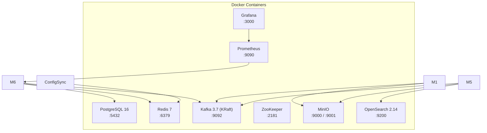
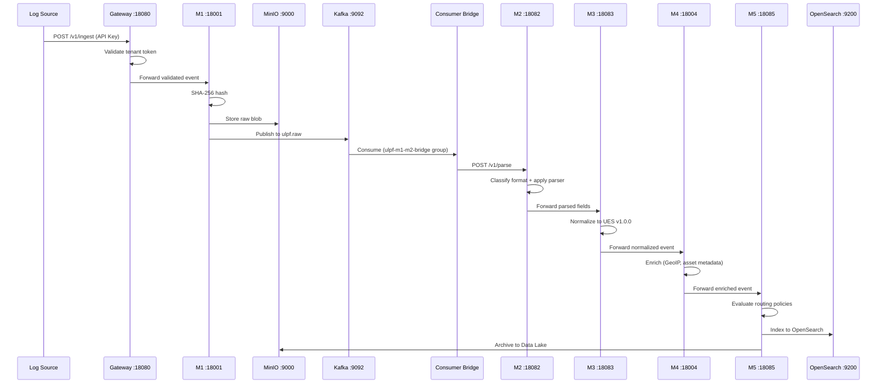
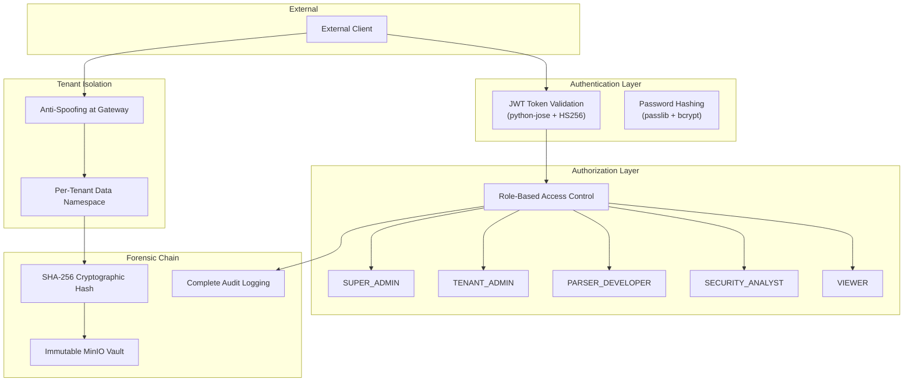
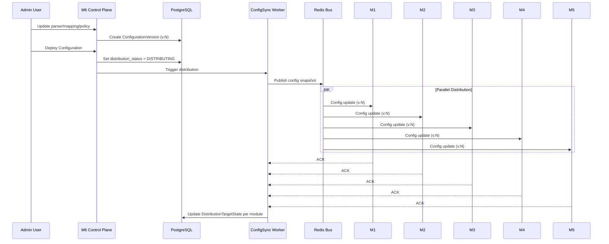

# ULPF — System Architecture

> Detailed technical architecture of the Universal Log Pre-processing Framework.

---

## Architecture Overview

ULPF follows a **microservice pipeline architecture** where raw security logs flow through 5 sequential processing stages (M1→M5), governed by a central control plane (M6) and supported by an integration layer (Gateway, ConfigSync, Health Aggregator, Consumer Bridge).

```mermaid
flowchart LR
    subgraph Sources["Log Sources"]
        S1["Cisco ASA"]
        S2["Fortinet"]
        S3["Palo Alto"]
        S4["Windows Events"]
        S5["Generic Syslog"]
    end

    subgraph Pipeline["Processing Pipeline"]
        direction TB
        M1["M1 Ingestion"]
        M2["M2 Classification"]
        M3["M3 Normalization"]
        M4["M4 Enrichment"]
        M5["M5 Routing"]
    end

    subgraph Destinations["Destinations"]
        OS["OpenSearch"]
        DL["Data Lake"]
        KF["Kafka Stream"]
        WH["HTTP Webhooks"]
    end

    Sources --> M1
    M1 --> M2
    M2 --> M3
    M3 --> M4
    M4 --> M5
    M5 --> Destinations
```



---

## Module Specifications

### M1 — Ingestion & Raw Vault

| Attribute | Value |
|:--|:--|
| **Port** | 18001 (HTTP), 18514 (UDP Syslog), 18515 (TCP Syslog) |
| **Technology** | Python 3.12, FastAPI, aiokafka, MinIO SDK |
| **Location** | `M1/modules/m1-ingestion/` |
| **Virtual Env** | `M1/modules/m1-ingestion/.venv/` |

**Responsibilities:**
- Accept raw log events via HTTP API, UDP Syslog, and TCP Syslog
- Compute SHA-256 cryptographic hash for each event (forensic evidence chain)
- Store raw event blob in MinIO S3-compatible object storage (`ulpf-raw` bucket)
- Persist to durable SQLite outbox for at-least-once delivery
- Publish event to Kafka topic `ulpf.raw` (3 partitions)
- Enforce tenant token authentication

**Key Endpoints:**
- `GET /health` — Service health
- `GET /ready` — Readiness (Kafka producer + MinIO connectivity)
- `POST /v1/events` — Ingest raw event

---

### M2 — Format Classifier & Parser Engine

| Attribute | Value |
|:--|:--|
| **Port** | 18082 |
| **Technology** | Python 3.12, FastAPI, regex |
| **Location** | `M2/abcd-main/` |

**Responsibilities:**
- Detect log format (Cisco ASA, Fortinet, Palo Alto, Windows Event, Generic Syslog)
- Apply matching regex parser to extract structured fields
- ReDoS polynomial backtracking guard (prevents regex denial of service)
- Parser Studio sandbox for developing and testing regex patterns
- Dynamic parser registration and storage

**Key Endpoints:**
- `GET /health` — Service health
- `POST /v1/parse` — Classify and parse a raw log line
- `GET /v1/parsers` — List registered parsers
- `POST /v1/parsers` — Register new parser definition
- `POST /v1/parsers/{id}/test` — Test parser against sample input

---

### M3 — UES Canonical Normalizer

| Attribute | Value |
|:--|:--|
| **Port** | 18083 |
| **Technology** | Python 3.12, FastAPI, YAML mappings |
| **Location** | `M3/` |
| **Frontend** | `M3/frontend/` (React + Vite on :5174) |

**Responsibilities:**
- Transform vendor-specific parsed fields into Universal Event Schema (UES) v1.0.0
- Load vendor-to-UES mapping definitions from YAML files
- Preserve original vendor fields in the normalized output
- Attach provenance metadata (source module, processing timestamp, mapping version)
- Validate normalized events against UES JSON Schema

**Supported Vendor Mappings:**

| Vendor | Mapping Directory | Status |
|:--|:--|:--:|
| Cisco ASA | `mappings/cisco/` | 🟢 Active |
| Fortinet | `mappings/fortinet/` | 🟢 Active |
| Palo Alto | `mappings/paloalto/` | 🟢 Active |
| Windows Events | `mappings/windows/` | 🟢 Active |
| Generic Syslog | `mappings/generic/` | 🟢 Active |
| Custom (legacy) | `mappings/custom_mapping.yaml` | ⚠️ Skipped (schema errors) |
| Cisco Audit (legacy) | `mappings/audit_mapping_cisco.yaml` | ⚠️ Skipped (schema errors) |

---

### M4 — Context Enrichment Engine

| Attribute | Value |
|:--|:--|
| **Port** | 18004 |
| **Technology** | Python 3.12, FastAPI |
| **Location** | `M4/` |

**Responsibilities:**
- GeoIP resolution for source and destination IP addresses
- Asset metadata lookup (device type, location, owner, criticality)
- Threat intelligence correlation

---

### M5 — Smart Router & Delivery Engine

| Attribute | Value |
|:--|:--|
| **Port** | 18085 |
| **Technology** | Python 3.12, FastAPI, OpenSearch SDK, MinIO SDK |
| **Location** | `M5/` |

**Responsibilities:**
- Evaluate YAML-defined routing policies against normalized events
- Route events to one or more destinations:
  - **OpenSearch** — Hot storage for real-time search and SIEM queries
  - **MinIO Data Lake** — Cold archival storage (S3-compatible)
  - **Kafka Stream** — AI/ML analytics stream
  - **HTTP Webhooks** — External system notifications
- Dead Letter Queue (DLQ) for failed deliveries
- Automatic retry with exponential backoff
- Delivery receipt tracking

**Connectors:**

| Connector | Directory | Mock Mode |
|:--|:--|:--|
| OpenSearch | `app/connectors/` | `OPENSEARCH_MOCK_MODE` |
| Data Lake (MinIO) | `app/datalake/` | `DATA_LAKE_MOCK_MODE` |
| Kafka AI Stream | `app/connectors/` | `KAFKA_MOCK_MODE` |
| HTTP Webhook | `app/connectors/` | `HTTP_MOCK_MODE` |

---

### M6 — Central Control Plane

| Attribute | Value |
|:--|:--|
| **Port** | 18086 (API), 5173 (Frontend) |
| **Technology** | Python 3.12, FastAPI, SQLAlchemy, Alembic, React 18, TypeScript, Vite |
| **Location** | `M6/M6-SIH-main/` |
| **Database** | PostgreSQL 16 |

**Responsibilities:**
- **Tenant Management** — Create, update, delete tenants with isolated namespaces
- **Source Registry** — Register and manage log sources per tenant
- **Parser Registry** — Manage parser definitions with versioning
- **Schema Registry** — Manage UES schema versions
- **Mapping Registry** — Manage vendor-to-UES field mappings with versioning
- **Policy Registry** — Manage routing policies with versioning
- **Configuration Distribution** — Atomically deploy versioned configurations to M1-M5
- **Service Registry** — Track health status of all pipeline modules
- **Audit Logging** — Record all administrative actions with user, action, entity, timestamp
- **Event Replay** — Re-process historical events through the pipeline
- **RBAC** — 5-role hierarchy (Super Admin, Tenant Admin, Parser Developer, Security Analyst, Viewer)
- **JWT Authentication** — Token-based auth with access/refresh tokens

**Backend Architecture:**

```
backend/app/
├── api/              # 14 FastAPI routers
│   ├── auth.py       # Authentication (login, refresh, user management)
│   ├── tenants.py    # Tenant CRUD
│   ├── sources.py    # Source CRUD
│   ├── parsers.py    # Parser CRUD + testing
│   ├── schemas.py    # Schema CRUD
│   ├── mappings.py   # Mapping CRUD
│   ├── policies.py   # Policy CRUD
│   ├── services.py   # Service health registry
│   ├── audit.py      # Audit log queries
│   ├── replay.py     # Event replay operations
│   ├── configuration.py  # Config deployment
│   ├── kafka.py      # Kafka topic management
│   ├── health.py     # Health endpoints
│   └── metrics.py    # Prometheus metrics
├── models/           # 13 SQLAlchemy ORM models
├── schemas/          # Pydantic v2 request/response schemas
├── services/         # Business logic
├── repositories/     # Data access layer
├── integrations/     # External service clients
├── core/             # Config, RBAC, security, logging
├── audit/            # Audit infrastructure
└── health/           # Health check logic
```

---

## Integration Layer

### Ingress Security Gateway (Port 18080)

| Location | `integration/security/ingress_gateway.py` |
|:--|:--|

- Tenant boundary enforcement via API key validation
- Anti-spoofing validation
- Forwards validated events to M1
- Returns 503 with structured JSON when M1 is unavailable

### ConfigSync Worker (Port 18081)

| Location | `integration/config_sync/config_worker.py` |
|:--|:--|

- Subscribes to Redis pub/sub for configuration change events
- Distributes versioned configuration snapshots to M1-M5
- Tracks per-module acknowledgment via DistributionTargetState

### M1→M2 Kafka Consumer Bridge

| Location | `integration/consumers/` |
|:--|:--|

- Consumes from Kafka topic `ulpf.raw` (consumer group: `ulpf-m1-m2-bridge`)
- Provides at-least-once delivery guarantee
- Idempotency filter using SHA-256 deduplication
- Forwards parsed-ready events to M2 HTTP API

### System Health Aggregator (Port 18090)

| Location | `integration/observability/health.py` |
|:--|:--|

- Probes health endpoints of all 8 services (M1-M6, Gateway, ConfigSync)
- Aggregates health status into a single `/live` and `/health` response
- Used by the M6 frontend System page for live status display

---

## Infrastructure Dependencies



---

## Data Flow Diagram



---

## Security Architecture



---

## Configuration Distribution Architecture



---

## Universal Event Schema (UES v1.0.0)

The canonical normalized event format that M3 produces:

```json
{
  "ues_version": "1.0.0",
  "event_id": "uuid",
  "timestamp": "ISO-8601",
  "source": {
    "ip": "192.168.1.1",
    "port": 443,
    "hostname": "fw-01",
    "type": "firewall"
  },
  "destination": {
    "ip": "10.0.0.5",
    "port": 8080
  },
  "event": {
    "category": "network",
    "action": "deny",
    "outcome": "failure",
    "severity": "high"
  },
  "observer": {
    "vendor": "Cisco",
    "product": "ASA",
    "version": "9.16"
  },
  "tenant_id": "expedition-42",
  "provenance": {
    "raw_hash": "sha256:...",
    "parser_id": "cisco-asa-v1",
    "mapping_id": "cisco-ues-mapping",
    "processing_chain": ["M1", "M2", "M3", "M4"],
    "ingested_at": "ISO-8601",
    "normalized_at": "ISO-8601"
  },
  "vendor_fields": {
    "cisco_message_id": "106023",
    "cisco_acl_name": "outside_access_in"
  }
}
```

---

## Deployment Architecture

### Development (Current)

- **Hybrid deployment**: Infrastructure in Docker, microservices as native processes
- **Orchestrator**: `run_stack.py` manages process lifecycle with health probing
- **Target OS**: Windows 10/11

### Docker Compose Standalone (M6 only)

- Full infrastructure + M6 API in containers
- M1-M5 external (URLs configured via environment variables)

### Production (Future)

- Kubernetes / Docker Swarm deployment
- Managed PostgreSQL, Redis, Kafka (AWS/GCP/Azure)
- Container registry for M1-M6 images
- Horizontal scaling for M1 (ingestion) and M5 (routing)
