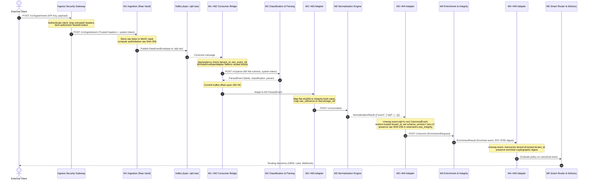

# ULPF Phase 1 — Integration Architecture Specification

## 1. Executive Summary & Architectural Overview

The Universal Log Preprocessing Framework (ULPF) integrates six independent, pre-existing microservices (`M1` through `M6`) into a cohesive, production-grade log processing pipeline without collapsing their independent repositories into a monolithic codebase. 

The integration architecture establishes an **out-of-process integration layer** that handles contract adaptation, transport bridging, mutual service authentication, tenant context preservation, configuration synchronization, end-to-end tracing, and idempotency deduplication while strictly respecting frozen module boundaries.

```
                            ┌────────────────────────────────────────┐
                            │                  M6                    │
                            │      Platform Control Plane & UI       │
                            └───────────────────┬────────────────────┘
                                                │
                                  POST /config/apply (Transactional Outbox)
                                                │
                                                ▼
┌──────────────────────────────────────────────────────────────────────────────────────────────────┐
│                                     ULPF INTEGRATION LAYER                                       │
│                                                                                                  │
│  ┌─────────────────────────┐   ┌──────────────────────────┐   ┌───────────────────────────────┐  │
│  │ Ingress Security Gateway│   │  M1 Kafka Consumer Bridge│   │  Configuration Sync Worker    │  │
│  │ (Anti-spoofing boundary)│   │  (Idempotent dispatcher) │   │  (M6 transactional receiver)  │  │
│  └─────────────────────────┘   └──────────────────────────┘   └───────────────────────────────┘  │
│                                                                                                  │
│  ┌─────────────────────────┐   ┌──────────────────────────┐   ┌───────────────────────────────┐  │
│  │ M1->M2 Envelope Adapter │   │   M2->M3 Event Adapter   │   │     M3->M4 Contract Adapter   │  │
│  │ (Flatten nested blocks) │   │ (Integrity & ref nesting)│   │  (Unwrap UES, restore tenant) │  │
│  └─────────────────────────┘   └──────────────────────────┘   └───────────────────────────────┘  │
│                                                                                                  │
│  ┌─────────────────────────┐   ┌──────────────────────────┐   ┌───────────────────────────────┐  │
│  │  M4->M5 Tenant Adapter  │   │  Tenant Context Guard    │   │  System Health & Metrics      │  │
│  │ (Harmonize tenant keys) │   │ (Cross-module propagation│   │ (Aggregated readiness/latencies) │
│  └─────────────────────────┘   └──────────────────────────┘   └───────────────────────────────┘  │
└──────────────────────────────────────────────────────────────────────────────────────────────────┘
            │                        │                        │                        │
            ▼                        ▼                        ▼                        ▼
      ┌───────────┐            ┌───────────┐            ┌───────────┐            ┌───────────┐
      │    M1     │            │    M2     │            │    M3     │            │    M4     │
      │ Ingestion │──[Kafka]──▶│  Parser   │──[HTTP]───▶│Normalizer │──[HTTP]───▶│Enrichment │──[HTTP]──┐
      │ Raw Vault │  ulpf.raw  │Discovery  │            │Validation │            │ Integrity │          │
      └───────────┘            └───────────┘            └───────────┘            └───────────┘          │
                                                                                                        ▼
                                                                                                  ┌───────────┐
                                                                                                  │    M5     │
                                                                                                  │  Router   │
                                                                                                  │ Delivery  │
                                                                                                  └───────────┘
```

---

## 2. Runtime Event Flow

The lifecycle of an event through the ULPF pipeline transitions through six distinct hops:



---

## 3. Data Structures & Identity Architecture

To eliminate identity conflation across the six modules, the integration layer strictly separates and enforces three distinct identifier concepts:

| Identifier | Concept | Source Authority | Purpose | Immutability |
| :--- | :--- | :--- | :--- | :--- |
| `raw_event_id` | Evidence Identity | **M1** (Ingestion) | References immutable blob in MinIO/S3 raw storage vault. | Strictly immutable. Never altered or overwritten. |
| `event.id` | Canonical Event Identity | **M3** (Normalizer) | Unique identity of the normalized UES representation. | Generated during normalization (`EVT-...`). |
| `correlation_id` | Distributed Trace Identity | **Ingress Gateway** | Tracks execution flow across all network hops and logs. | Propagated via `X-Correlation-ID` across all services. |

---

## 4. Dual Cryptographic Integrity Architecture

A core design requirement of ULPF is the coexistence of two independent cryptographic integrity claims:

1. **M1 Raw Byte Digest (`raw_hash`)**:
   - **Algorithm**: SHA-256 over exact inbound raw network bytes before any string parsing or decoding.
   - **Authoritative Producer**: M1 Ingestion Engine.
   - **Guarantees**: Non-repudiation of original forensic evidence in the immutable raw vault.
   - **Preservation**: The integration adapters carry this hash forward through all stages (`M1 -> M2 sha256 -> M3 integrity.raw_hash -> M4 extensions.raw_integrity.raw_hash`).
   - **Rule**: Adapters NEVER recompute or overwrite this digest.

2. **M4 Canonical Enriched Digest (`enriched_digest`)**:
   - **Algorithm**: RFC 8785 (Canonical JSON) + SHA-256.
   - **Authoritative Producer**: M4 Integrity Subsystem.
   - **Guarantees**: Tamper-evidence of normalized and enriched semantic fields.
   - **Preservation**: Carried in `event["integrity"]` when presented to M5 and downstream analytical consumers.

---

## 5. Deployment Topology & Service Discovery

All inter-module network communication uses container service discovery names over a dedicated internal Docker network (`ulpf-net`). Inter-service calls never use `localhost`. 

Host port bindings are fully arbitrated to eliminate all port collisions discovered in Phase 0:

| Service | Container Internal Port | Arbitrated Host Port | Collision Resolution Rationale |
| :--- | :--- | :--- | :--- |
| **Ingress Security Gateway** | `8080` | **`8080`** | Public external entrypoint for tenant clients. |
| **M1 Ingestion Backend** | `8000` | **`8001`** | Moved from default 8000 to eliminate collision with M6 backend. |
| **M2 Parser Engine** | `8000` | **`8082`** | Standard isolated port for M2 parsing and discovery APIs. |
| **M3 UES Normalizer** | `8000` (API) / `5173` (UI) | **`8083` / `5174`** | M3 UI moved to 5174 to eliminate collision with M6 UI (5173). |
| **M4 Enrichment & Integrity** | `8000` | **`8004`** | Standard isolated port for M4 enrichment API. |
| **M5 Policy Router** | `8000` | **`8085`** | Standard isolated port for M5 policy query and management API. |
| **M6 Control Plane Backend** | `8000` | **`8086`** | Dedicated host port for control plane REST API. |
| **M6 Control Plane UI** | `5173` | **`5173`** | Primary administrative management dashboard. |
| **Configuration Sync Worker**| `8081` | **`8081`** | Target for M6 transactional outbox distributions (`POST /config/apply`).|
| **System Health Aggregator** | `8090` | **`8090`** | Unified `/health` probe for all modules and infrastructure. |

---

## 6. Service Responsibility Matrix

| Subsystem | Source Directory | Responsibility | Integration Boundary Handling |
| :--- | :--- | :--- | :--- |
| **Ingress Gateway** | `integration/security/` | Client authentication, anti-spoofing, rate limiting. | Strips external headers, injects trusted `TenantContext`. |
| **M1 Ingestion** | `M1/modules/m1-ingestion` | Network listeners (HTTP/Syslog), MinIO vault, raw hashing. | Emits nested `RawEventEnvelope` to Kafka `ulpf.raw`. |
| **M1-M2 Bridge** | `integration/consumers/` | Durable Kafka consumer, at-least-once deduplication. | Commits Kafka offset only upon M2 HTTP 200 ACK. |
| **M2 Parser** | `M2/abcd-main` | Format classification, regex/KV extraction, parser registry. | Expects flattened envelope schema via `M1RawEnvelopeAdapter`. |
| **M3 Normalizer** | `M3` | Schema mapping to UES v1 blocks, type conversion. | Input adapted via `M2M3Adapter`; outputs nested `event.ulpf`. |
| **M3-M4 Bridge** | `integration/adapters/` | Contract elevation and tenant restoration. | Flattens `event.ulpf`, injects verified tenant, enforces `ues.v1`. |
| **M4 Enrichment** | `M4` | Asset lookup, GeoIP, threat intel, RFC-8785 hashing. | Emits `EnrichmentResult` with post-enrichment digest. |
| **M4-M5 Bridge** | `integration/adapters/` | Tenant harmonization and event unwrapping. | Populates `tenant.id = tenant.tenant_id` for M5 SmartRouter. |
| **M5 Router** | `M5` | Deterministic policy evaluation, multi-destination delivery. | Routes event to SIEM (OpenSearch), Data Lake (S3), Kafka. |
| **M6 Control Plane** | `M6/M6-SIH-main` | User auth, RBAC, configuration CRUD, transactional outbox. | Dispatches versioned configuration events to `POST /config/apply`. |
| **Config Sync** | `integration/config_sync/` | Configuration translation, atomic persistence, ACKs. | Translates M6 events to M1-M5 specific configuration APIs. |
