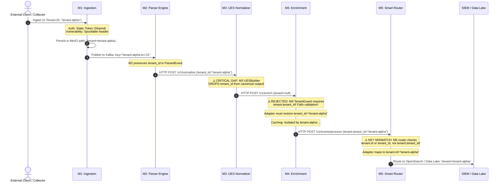

# ULPF Phase 0 — End-to-End Tenant Flow & Isolation Analysis

**Audit Date**: September 14, 2026  
**Status**: Complete  
**Scope**: Verification of tenant identity propagation, boundary validation, isolation integrity, and leakage vectors across all pipeline stages.

---

## 1. Pipeline Tenant Propagation Lifecycle

The diagram below illustrates how tenant identity traverses the ULPF pipeline, highlighting exact points where tenant context is validated, transformed, or dropped:



---

## 2. Forensic Multi-Tenancy Matrix Across Modules

| Dimension | Module 1 (Ingestion) | Module 2 (Parser) | Module 3 (Normalizer) | Module 4 (Enrichment) | Module 5 (Router) | Module 6 (Control Plane) |
| :--- | :--- | :--- | :--- | :--- | :--- | :--- |
| **Authentication** | Static Bearer Token (`settings.api_auth_token`) | API Key + Role Context (`AuthContext`) | Request size limit (No direct auth middleware) | API Key + Role Context (`AuthenticatedPrincipal`) | Token & API Key (`TenantContext`) | JWT Bearer Tokens + Bcrypt passwords |
| **Tenant Extraction** | Header `X-Tenant-ID` (fallback to `default_tenant_id`) | Extracted from `RawEventEnvelope.tenant_id` | Parsed into `ParsedEvent` (via `extra="allow"`), then ignored | Extracted from `EnrichmentRequest.tenant_context` | Extracted via `extract_tenant_id` from `tenant.id` or `tenant_id` | Extracted from user claim / query param |
| **Validation** | Verifies token, but does **not** validate tenant against an authorized tenant list | Enforces parser access permissions by tenant | **None** (ignores tenant metadata) | `TenantGuard` asserts event tenant matches authorized principal scope | `TenantContext` asserts user tenant matches requested query tenant | Checks DB user tenant |
| **Persistence Partitioning** | MinIO object key: `tenant={tenant}/...` | Parsers stored in `./parsers/` with optional `tenant_id` | **None** (output schema lacks tenant field) | In-memory cache key: `tenant_id:provider_id:namespace:key` | Partitioned JSONL: `./data/datalake/.../tenant={tenant}/...` | PostgreSQL tables with `tenant_id` foreign keys |
| **Policy & Config Scoping** | Global settings | Scoped parsers (`tenant_id` or `global`) | Global YAML mappings | Scoped enrichment rules and local CMDB assets | Routing rules with optional `tenant_id` matching filter | Multi-tenant source catalog |

---

## 3. Detailed Tenant Integrity Vulnerabilities Discovered

### 3.1 Vulnerability 1: Header Spoofing at Ingestion Boundary (M1)
- **Code Reference**: `M1/modules/m1-ingestion/app/transports/http.py:52`
  ```python
  tenant_id = request.headers.get("X-Tenant-ID", settings.default_tenant_id)
  ```
- **Vulnerability**: M1 authenticates requests using a single platform-wide API secret (`settings.api_auth_token`). Any client with a valid token can inject an arbitrary `X-Tenant-ID: victim-tenant` header, causing victim partition pollution in MinIO and Kafka topic `ulpf.raw`.
- **Severity**: **P1 (Security / Architecture)**.
- **Required Remediation**: In the edge gateway / integration adapter layer, enforce cryptographically verified client credentials (e.g. mTLS or tenant-specific JWT/API keys) that bind the client identity to an authorized tenant scope before passing to M1.

### 3.2 Vulnerability 2: Silent Tenant Loss during Normalization (M3)
- **Code Reference**: `M3/app/normalizer/builder.py` and `M3/schema/ues/v1.0.0/ues.schema.json`
- **Vulnerability**: M3 receives `ParsedEvent` which includes `tenant_id="tenant-alpha"`. However, M3's canonical JSON schema (`ues.schema.json`) defines `ULPFBlock` with properties:
  `["schema", "event", "observer", "source", "destination", "network", "host", "identity", "application", "process", "security", "parser", "normalization", "provenance", "integrity", "raw", "vendor", "extensions"]`.
  It **completely omits a `tenant` property**!
  Furthermore, `builder.py:_construct_ues` never extracts or maps `event.tenant_id`.
- **Impact**: Any event passed through standard M3 normalization is stripped of its tenant identity.
- **Severity**: **P0 (Critical Functional Defect)**.
- **Required Remediation**: The integration adapter layer bridging M3 $\to$ M4 must capture the incoming `tenant_id` from M2's output and re-inject it into the canonical event model as `tenant: {"tenant_id": ...}` prior to calling M4.

### 3.3 Vulnerability 3: Tenant Schema Key Mismatch (M4 $\to$ M5)
- **Code Reference**:
  - M4: `app/contracts/canonical_event.py:182`:
    ```python
    class TenantMetadata(BaseModel):
        tenant_id: str = Field(default="default")
    ```
    Emits `{"tenant": {"tenant_id": "tenant-alpha"}}`.
  - M5: `app/router/router.py:41`:
    ```python
    def extract_tenant_id(self, event: Dict[str, Any]) -> Optional[str]:
        tenant_id = extract_field_value(event, "tenant.id")
        if not tenant_id:
            tenant_id = event.get("tenant_id") or extract_field_value(event, "tenant_id")
        return str(tenant_id) if tenant_id else None
    ```
- **Vulnerability**: M5 looks for `event["tenant"]["id"]` or `event["tenant_id"]`. It **does not check** `event["tenant"]["tenant_id"]`.
- **Impact**: When M4 hands off an event to M5, M5's `extract_tenant_id()` resolves to `None`. Any policy rule configured with `rule.tenant_id = "tenant-alpha"` evaluates as non-matching!
- **Severity**: **P1 (High)**.
- **Required Remediation**: The integration layer must normalize the tenant block to include both `id` and `tenant_id` (`{"tenant": {"id": "tenant-alpha", "tenant_id": "tenant-alpha"}}`).

### 3.4 Vulnerability 4: Platform-Global Users in Control Plane (M6)
- **Code Reference**: `M6/backend/app/models/user.py` and `backend/app/api/endpoints/sources.py`
- **Vulnerability**: M6 user records do not possess mandatory tenant bindings. A user with the `VIEWER` role can query `GET /api/v1/sources` without providing a `tenant_id` filter, returning registered log sources across all customer tenants.
- **Severity**: **P1 (Control Plane Privacy)**.
- **Required Remediation**: M6 API queries must be scoped to the authenticated user's assigned tenant context.
